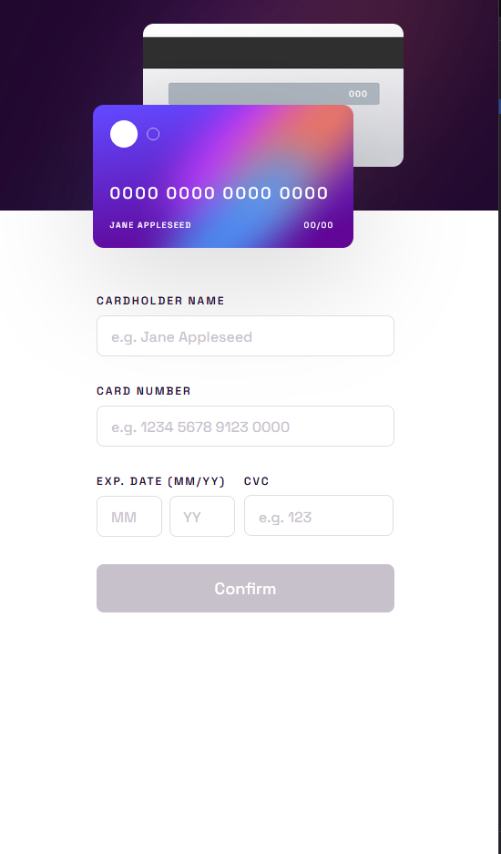

# Frontend Mentor - Interactive card details form solution

This is a solution to the [Interactive card details form challenge on Frontend Mentor](https://www.frontendmentor.io/challenges/interactive-card-details-form-XpS8cKZDWw). Frontend Mentor challenges help you improve your coding skills by building realistic projects. 

## Table of contents

- [Overview](#overview)
  - [The challenge](#the-challenge)
  - [Screenshot](#screenshot)
  - [Links](#links)
- [My process](#my-process)
  - [Built with](#built-with)
- [Author](#author)
- [Acknowledgments](#acknowledgments)

## Overview

### The challenge

Users should be able to:

- Fill in the form and see the card details update in real-time
- Receive error messages when the form is submitted if:
  - Any input field is empty
  - The card number, expiry date, or CVC fields are in the wrong format
- View the optimal layout depending on their device's screen size
- See hover, active, and focus states for interactive elements on the page

### Screenshot

Desktop size:

Mobile

### Links

- Solution URL: [Add solution URL here](https://www.frontendmentor.io/solutions/interactive-card-details-vanilla-js-J7EW0FM6-u)
- Live Site URL: [Live site URL](https://interactive-card-details-nu.vercel.app/)

## My process

### Built with

- Semantic HTML5 markup
- CSS custom properties
- Flexbox
- CSS Grid
- Mobile-first workflow
- Vanilla Javascript

## Author

- Website - [In-Progress](https://github.com/DavidMorgade)
- Frontend Mentor - [@DavidMorgade](https://www.frontendmentor.io/profile/DavidMorgade)
- Twitter - [@MeSabeAgridulce](https://www.twitter.com/mesabeagridulce)

## Acknowledgments

Thanks to my wife and my little child for helping me reaching my dreams and continue going forward, this is not a long run, this is a infinite run of different emotions that at the end of the day, it makes you happier!
