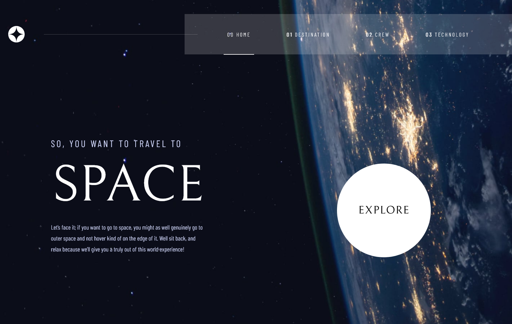
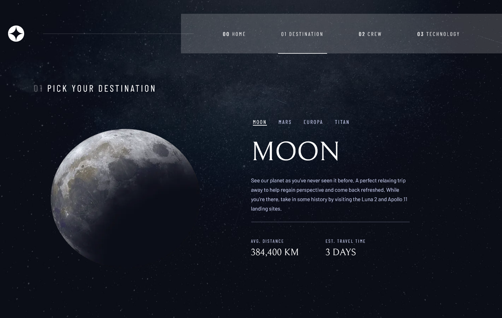
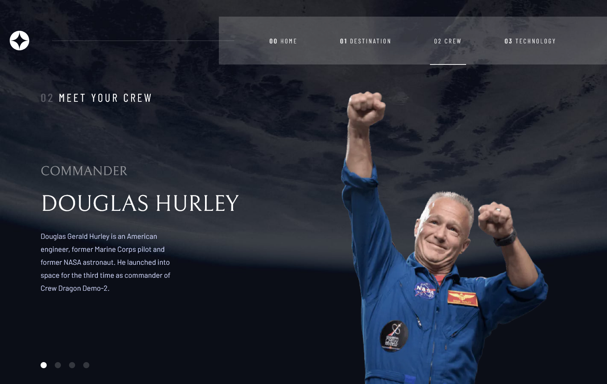
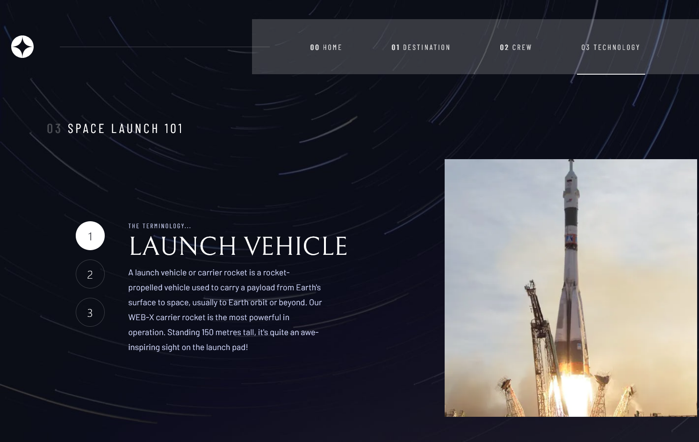

# Frontend Mentor - Space tourism website solution

This is a solution to the [Space tourism website challenge on Frontend Mentor](https://www.frontendmentor.io/challenges/space-tourism-multipage-website-gRWj1URZ3). Frontend Mentor challenges help you improve your coding skills by building realistic projects. 

This challenge was done as a practice for the NextJS react framework.

## Table of contents

- [Overview](#overview)
  - [The challenge](#the-challenge)
  - [Screenshot](#screenshot)
  - [Links](#links)
- [My process](#my-process)
  - [Built with](#built-with)
  - [What I learned](#what-i-learned)
  - [Continued development](#continued-development)
- [Author](#author)
- [Acknowledgments](#acknowledgments)

## Overview

### The challenge

Users should be able to:

- View the optimal layout for each of the website's pages depending on their device's screen size 
- See hover states for all interactive elements on the page
- View each page and be able to toggle between the tabs to see new information

### Screenshot

Desktop Version:

Homepage:



Destinations:



Crew:



Technology:



You can checkout the rest of the project in different sizes.

### Links

- Solution URL: (https://www.frontendmentor.io/solutions/space-tourism-spa-with-nextjs-NL9LuFYcPp)
- Live Site URL: (https://space-tourism-page-rho.vercel.app/)

## My process

### Built with

- Semantic HTML5 markup
- SCSS modules
- Flexbox
- CSS Grid
- Mobile-first workflow
- [React](https://reactjs.org/) - JS library
- [Next.js](https://nextjs.org/) - React framework


### What I learned

In this project I learnt a lot of react and next utilities than can save a lot of time reinventing the wheel for example:

Custom react useContext hooks for managing the context without the need to call useState in the same component, just need to wrap de _app with the provider like I would do with normal useContext

```jsx
import { createContext, useContext, useState } from 'react';

const MenuContext = createContext();

export function MenuWrapper({ children }) {
  const [menu, setMenu] = useState(false);

  return (
    <MenuContext.Provider value={[menu, setMenu]}>
      {children}
    </MenuContext.Provider>
  );
}
export function useMenuContext() {
  return useContext(MenuContext);
}

```

A helper function to determine de background image depending on the window size:

```js
const determineBgImage = (desktop, tablet, mobile, size) => {
  const bgImage =
    size >= 0 && size <= 768
      ? mobile
      : size >= 768 && size <= 1440
      ? tablet
      : desktop;
  return bgImage;
};

export default determineBgImage;

}
```
A custom hook to determine de window size, the useWindowSize hook:

```jsx
import { useState, useEffect } from 'react';

// Hook
const useWindowSize = () => {
  // Initialize state with undefined width/height so server and client renders match
  // Learn more here: https://joshwcomeau.com/react/the-perils-of-rehydration/
  const [windowSize, setWindowSize] = useState({
    width: undefined,
    height: undefined,
  });

  useEffect(() => {
    // only execute all the code below in client side
    if (typeof window !== 'undefined') {
      // Handler to call on window resize
      function handleResize() {
        // Set window width/height to state
        setWindowSize({
          width: window.innerWidth,
          height: window.innerHeight,
        });
      }

      // Add event listener
      window.addEventListener('resize', handleResize);

      // Call handler right away so state gets updated with initial window size
      handleResize();

      // Remove event listener on cleanup
      return () => window.removeEventListener('resize', handleResize);
    }
  }, []); // Empty array ensures that effect is only run on mount
  return windowSize;
};

export default useWindowSize;

```

### Continued development

For future projects I want to add more life to the page with some react-transition-group animations or framer motion, also improve the quality of my code and my components, wich most of them in this case arent reusable.


## Author

- Website - [David Morgade](https://github.com/DavidMorgade)
- Frontend Mentor - [@DavidMorgade](https://www.frontendmentor.io/profile/DavidMorgade)
- Twitter - [@MeSabeAgridulce](https://twitter.com/MeSabeAgridulce)
- Linkedin - [@davidmorgade](https://www.linkedin.com/in/davidmorgade/)

## Acknowledgments

All of this couldnt be done with the help and patient of my lovely wife, who is helping me with the moral part of this world, keep going!
