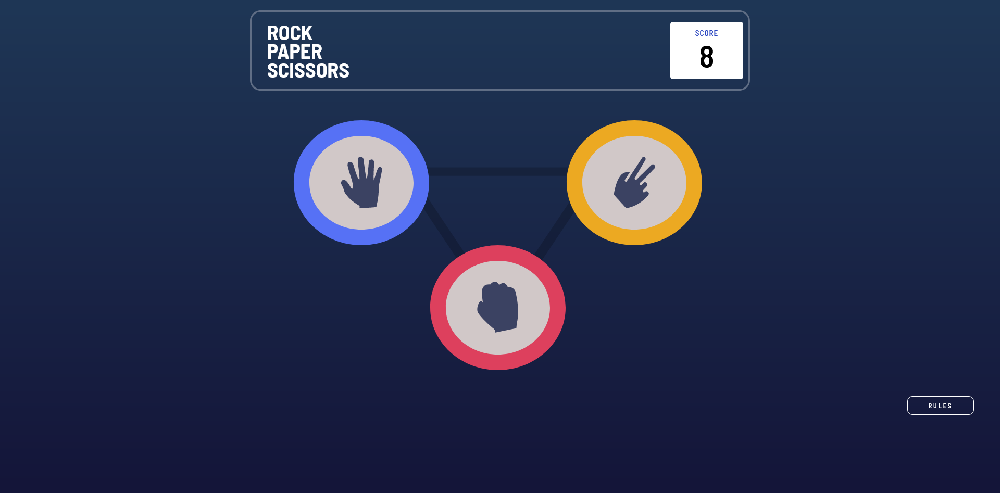
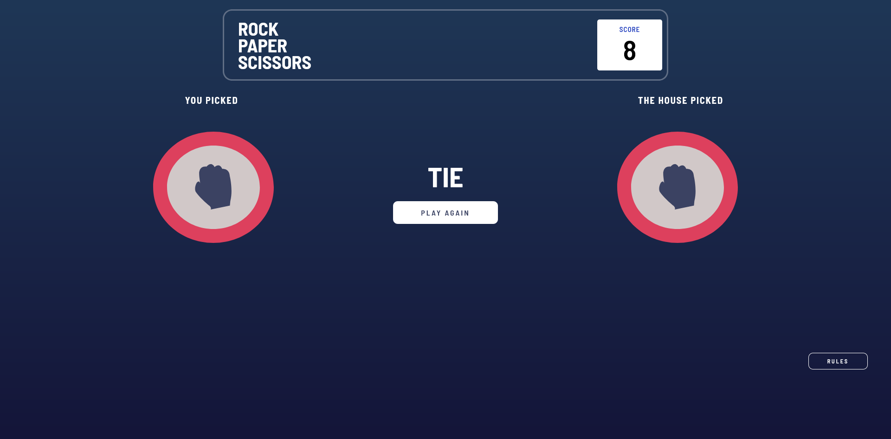

# Frontend Mentor - Rock, Paper, Scissors solution

This is a solution to the [Rock, Paper, Scissors challenge on Frontend Mentor](https://www.frontendmentor.io/challenges/rock-paper-scissors-game-pTgwgvgH).

## Table of contents

- [Frontend Mentor - Rock, Paper, Scissors solution](#frontend-mentor---rock-paper-scissors-solution)
  - [Table of contents](#table-of-contents)
  - [Overview](#overview)
    - [The challenge](#the-challenge)
    - [Screenshot](#screenshot)
    - [Links](#links)
  - [My process](#my-process)
    - [Built with](#built-with)
    - [What I learned](#what-i-learned)
    - [Continued development](#continued-development)
    - [Useful resources](#useful-resources)
  - [Author](#author)
  - [Acknowledgments](#acknowledgments)

**Note: Delete this note and update the table of contents based on what sections you keep.**

## Overview

### The challenge

Users should be able to:

- View the optimal layout for the game depending on their device's screen size
- Play Rock, Paper, Scissors against the computer
- Maintain the state of the score after refreshing the browser _(optional)_ -> Completed

### Screenshot

Game Start:



Game Finish:




### Links

- Solution URL: [https://www.frontendmentor.io/solutions/rock-paper-scissors-react-w4Xpt6tbKx]
- Live Site URL: [https://rock-paper-scissors-fronendmentor.netlify.app/]

## My process

### Built with

- CSS custom properties
- Flexbox
- CSS Grid
- Mobile-first
- CSS Modules
- [React](https://reactjs.org/) - JS library


### What I learned


How to use React Context API to change the UI and store the values of the game.

I learnt how to use the Provider (App.jsx)

```jsx
    <GameContext.Provider
      value={{
        startGame: startGameHandler,
        gameStart: startGame,
        setSelectedOption: selectOptionHandler,
        selectedOption,
        setBrowserOption: browserOptionHandler,
        browserOption,
        winner,
        setWinner,
        score,
        setScore: scoreHandler,
      }}
    >
```


Also how to use the use context hook in other components (src/components/game/ButtonSelector.jsx):


```jsx
  const gameCtx = useContext(GameContext);

  const gameIsGoing = (e) => {
    const browserOptions = ['rock', 'paper', 'scissors'];
    const selected = e.currentTarget.id;
    const selectedBrowser = browserOptions[randomOption(browserOptions)];
    gameCtx.startGame(true);
    gameCtx.setSelectedOption(selected);
    gameCtx.setBrowserOption(selectedBrowser);
    const winner = whoWinsTheGame(selected, selectedBrowser);
    winner === 'YOU WIN' && gameCtx.setScore(-1);
    winner === 'YOU LOSE' && gameCtx.setScore(1);
    gameCtx.setWinner(winner);
  };
```


I also improved my knowledge using the react useState and useEffect hooks (App.jsx):


```jsx
 const App = () => {
  const [modalOpen, setModalOpen] = useState(false);
  const [startGame, setStartGame] = useState(false);
  const [selectedOption, setSelectedOption] = useState('');
  const [browserOption, setBrowserOption] = useState('');
  const [winner, setWinner] = useState('');
  const [score, setScore] = useState(localStorage.getItem('score'));
  useEffect(() => {
    localStorage.setItem('score', score);
  }, [score]);
  const browserOptionHandler = (option) => {
    setBrowserOption(option);
  };
  const selectOptionHandler = (option) => {
    setSelectedOption(option);
  };
  const startGameHandler = (value) => {
    setStartGame(value);
  };
  const closeModalHandler = () => {
    setModalOpen(false);
  };
  const openModalHandler = () => {
    setModalOpen(true);
  };
  const scoreHandler = (value) => {
    setScore((prevScore) => prevScore - value);
  };
```


The logic to decide who wins the game (src/helpers/helpers.js):

```js
const whoWinsTheGame = (human, browser) => {
  const result =
    human === 'rock' && browser === 'paper'
      ? 'YOU LOSE'
      : human === 'rock' && browser === 'scissors'
      ? 'YOU WIN'
      : human === 'rock' && browser === 'rock'
      ? 'TIE'
      : human === 'paper' && browser === 'paper'
      ? 'TIE'
      : human === 'paper' && browser === 'scissors'
      ? 'YOU LOSE'
      : human === 'paper' && browser === 'rock'
      ? 'YOU WIN'
      : human === 'scissors' && browser === 'paper'
      ? 'YOU WIN'
      : human === 'scissors' && browser === 'scissors'
      ? 'TIE'
      : human === 'scissors' && browser === 'rock'
      ? 'YOU LOSE'
      : undefined;
  return result;
};

```


### Continued development

Improve my mobile first layout, and actually stay calm and find the best solution for mobile devices.

### Useful resources

- [https://www.udemy.com/course/react-the-complete-guide-incl-redux/] - The React course I took to learn and understand how React works.
- [https://www.udemy.com/course/the-complete-javascript-course/] - The complete Javascript Course, no need to explain, this course is the best one I had.
- [https://www.udemy.com/course/css-grid-y-flexbox-la-guia-definitiva-crea-10-proyectos/] - CSS and SASS course where I Learnt how to style a website and how to build mobile first apps.


## Author

- Website - [https://github.com/DavidMorgade]
- Frontend Mentor - [https://www.frontendmentor.io/profile/DavidMorgade]
- Twitter - [https://twitter.com/MeSabeAgridulce]
- Linkedin - [www.linkedin.com/in/davidMorgade]

## Acknowledgments

Thanks to my wife for giving me time, strength and a user-side opinion of all the work I do to get to my objectives.
