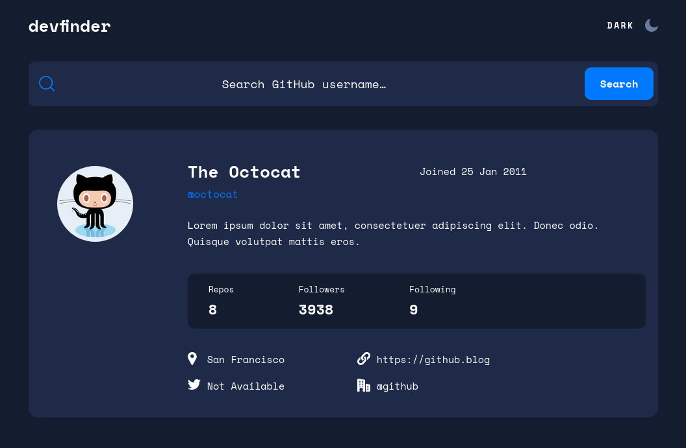
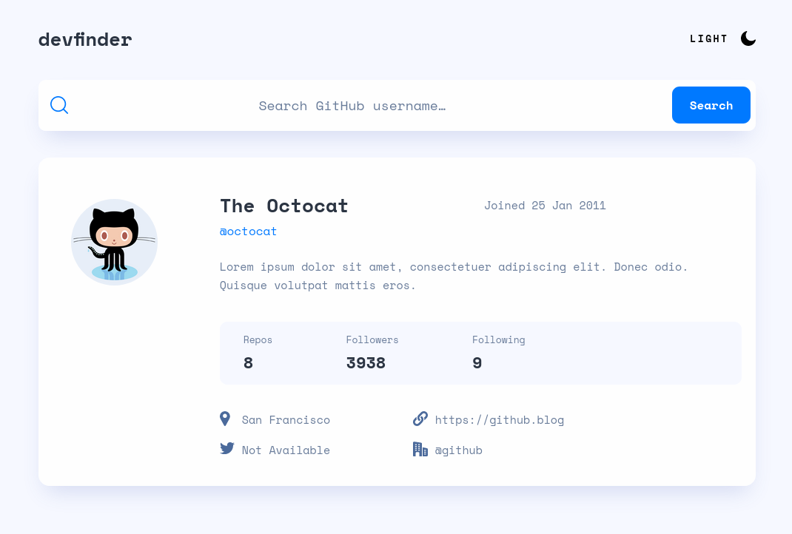

# Frontend Mentor - GitHub user search app solution

This is a solution to the [GitHub user search app challenge on Frontend Mentor](https://www.frontendmentor.io/challenges/github-user-search-app-Q09YOgaH6). 

## Table of contents

- [Overview](#overview)
  - [The challenge](#the-challenge)
  - [Screenshot](#screenshot)
  - [Links](#links)
- [My process](#my-process)
  - [Built with](#built-with)
  - [What I learned](#what-i-learned)
  - [Continued development](#continued-development)
  - [Useful resources](#useful-resources)
- [Author](#author)
- [Acknowledgments](#acknowledgments)


## Overview

### The challenge

Users should be able to:

- View the optimal layout for the app depending on their device's screen size
- See hover states for all interactive elements on the page
- Search for GitHub users by their username
- See relevant user information based on their search
- Switch between light and dark themes
- **Bonus**: Have the correct color scheme chosen for them based on their computer preferences. _Hint_: Research `prefers-color-scheme` in CSS.

### Screenshot

DarkMode:



LightMode:




### Links

- Solution URL: [Solution URL](https://www.frontendmentor.io/solutions/github-search-app-using-react-and-styled-components-hdpBXS6oNK)
- Live Site URL: [Live site URL here](https://github-user-search-app-eta.vercel.app/)

## My process

### Built with

- Semantic HTML5 markup
- CSS custom properties
- Flexbox
- CSS Grid
- Mobile-first workflow
- [React](https://reactjs.org/) - JS library
- React Hooks
- [Styled Components](https://styled-components.com/) - For styles


### What I learned

In this challenge I improved a lot on my fetching skills, also on the use of react hooks.

For the light and dark mode I used Styled components theming, was my first time using it and it felt quite easy in my opinion, compared to doing it with normal CSS or CSS modules.

This is my react custom hook for DarkMode:

```jsx
import { useEffect, useState } from "react";
export const useDarkMode = () => {
  const [theme, setTheme] = useState("light");

  const setMode = (mode) => {
    window.localStorage.setItem("theme", mode);
    setTheme(mode);
  };

  const themeToggler = () => {
    theme === "light" ? setMode("dark") : setMode("light");
  };

  useEffect(() => {
    const localTheme = window.localStorage.getItem("theme");
    localTheme && setTheme(localTheme);
  }, []);
  return [theme, themeToggler];
};

```

Creating Global styles with transitions and theme with Styled components

```jsx
import { createGlobalStyle } from "styled-components";
export const GlobalStyles = createGlobalStyle`
  body {
    background: ${({ theme }) => theme.body};
    transition: all 0.5s linear;
  }
`;

```

Setting the themes for light and dark mode:

```js
export const lightTheme = {
  body: "#F6F8FF",
  main: "#FEFEFE",
  text: "#2B3442",
  container: "#F6F8FF",
  lowerText: "#697C9A",
  toggleBorder: "#FFF",
  background: "#363537",
};
export const darkTheme = {
  body: "#141D2F",
  main: "#1E2A47",
  container: "#141D2F",
  text: "#FFFFFF",
  lowerText: "#FFFFFF",
  toggleBorder: "#6B8096",
  background: "#999",
};

}
```

This is how a styled component looks with theming:

```jsx
const StatsCont = styled.section`
  background-color: ${({ theme }) => theme.container};
  grid-column: 1 / 3;
  display: flex;
  justify-content: space-evenly;
  align-items: center;
  height: 8.5rem;
  margin-right: 2rem;
  border-radius: 1rem;
  @media (min-width: 768px) {
    justify-content: flex-start;
    padding-left: 3.2rem;
    gap: 9.9rem;
  }
  @media (min-width: 1440px) {
    grid-column: 2 / 3;
    width: 100%;
    align-self: center;
    margin: 0;
  }
`;
```

Also created a custom function to get the date and output a formatted date with a template string:

```jsx
const transformDate = (date) => {
  const newDate = new Date(date);
  const convertedMonth = newDate.toLocaleString("en-US", {
    month: "long",
  });
  const convertedDay = newDate.toLocaleString("en-US", {
    day: "2-digit",
  });
  const convertedYear = newDate.toLocaleString("en-US", {
    year: "numeric",
  });
  const finalDate = `Joined ${convertedDay} ${convertedMonth.slice(
    0,
    3
  )} ${convertedYear}`;
  return finalDate;
};

export default transformDate;
```

### Continued development

Will try to improve a bit my code organization and come back to this project to re-factor even more!

### Useful resources

- [How to create Light and Dark theme with styled components](https://www.smashingmagazine.com/2020/04/dark-mode-react-apps-styled-components/) - Here I learnt how to create theming and how to set diferent colors and use the theming inside my components.


## Author

- Website - [DavidMorgade](https://github.com/DavidMorgade/)
- Frontend Mentor - [@DavidMorgade](https://www.frontendmentor.io/profile/DavidMorgade)
- Twitter - [@MeSabeAgridulce](https://www.twitter.com/mesabeagridulce)

**Note: Delete this note and add/remove/edit lines above based on what links you'd like to share.**

## Acknowledgments

As always thanks to my wife and my little baby for helping me improving and giving me the motivation to keep going!
