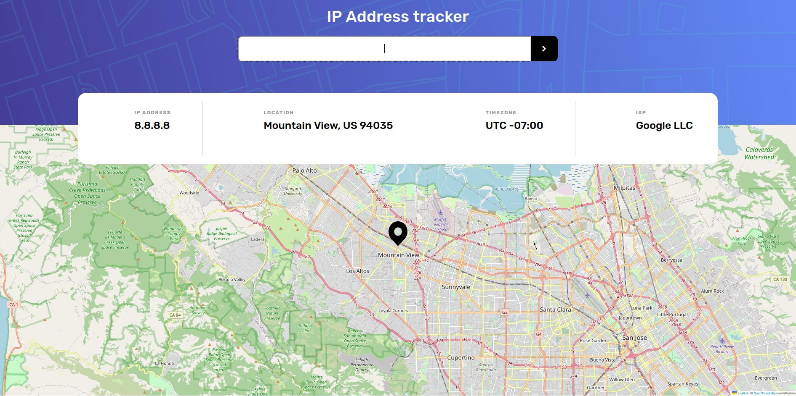

# Frontend Mentor - IP address tracker solution

This is a solution to the [IP address tracker challenge on Frontend Mentor](https://www.frontendmentor.io/challenges/ip-address-tracker-I8-0yYAH0). Frontend Mentor challenges help you improve your coding skills by building realistic projects. 

## Table of contents

- [Overview](#overview)
  - [The challenge](#the-challenge)
  - [Screenshot](#screenshot)
  - [Links](#links)
- [My process](#my-process)
  - [Built with](#built-with)
  - [What I learned](#what-i-learned)
  - [Continued development](#continued-development)
  - [Useful resources](#useful-resources)
- [Author](#author)
- [Acknowledgments](#acknowledgments)

**Note: Delete this note and update the table of contents based on what sections you keep.**

## Overview

### The challenge

Users should be able to:

- View the optimal layout for each page depending on their device's screen size
- See hover states for all interactive elements on the page
- See their own IP address on the map on the initial page load
- Search for any IP addresses or domains and see the key information and location

### Screenshot

Desktop web Screenshot:



### Links

- Solution URL: [Solution URL here](https://www.frontendmentor.io/solutions/ip-address-tracker-using-react-and-styled-components--cpc6lFXCu)
- Live Site URL: [Ip Address Location Web](https://ip-address-tracked-david-morgade.netlify.app/)

## My process

### Built with


- Flexbox
- Mobile-first workflow
- [React](https://reactjs.org/) - JS library
- [Styled Components](https://styled-components.com/) - For styles
- Functional Components / Hooks
- Custom Hooks

### What I learned

In this Challenge I learned a lot about leaflet and react-leaflet, how to place a map with react, how to change de position dinamically, how to place marks and how to pass data with Context. 

My map Component:

```jsx
const MapView = () => {
  const [data, setdata] = useDataContext({});
  const [loaded, setLoaded] = useLoadContext()
  const SetViewOnClick = ({ coords }) => {
    const map = useMap();
    map.setView(coords, map.getZoom());
  
    return null;
  }
  if(!loaded) return <Spinner />;
    return (

    <Fragment>
      {data && <MapContainer
        zoomControl={false}
        className="map"
        center={[data.location.lat, data.location.lng]}
        zoom={12}
        scrollWheelZoom={true}
      >
        <SetViewOnClick coords={[data.location.lat, data.location.lng]} />
        <TileLayer
          attribution='&copy; <a href="https://www.openstreetmap.org/copyright">OpenStreetMap</a> contributors'
          url="https://{s}.tile.openstreetmap.org/{z}/{x}/{y}.png"
        />
        <Marker position={[data.location.lat, data.location.lng]} icon={iconLocation}>
        </Marker>
      </MapContainer>}
    </Fragment>
  );
};

export default MapView;
```

Also learnt how to use styled components, since this project didnt need that much styles was a great introduction!

```js
import styled from "styled-components";
import { Arrow } from "../../images/images";

const InputSubmit = styled.input`
  all: unset;
  cursor: pointer;
  width: 7rem;
  height: 6rem;
  background-color: black;
  background-image: url(${Arrow});
  background-repeat: no-repeat;
  background-position: center;
  border-top-right-radius: 1rem;
  border-bottom-right-radius: 1rem;
`;
const InputText = styled.input`
  width: 27rem;
  height: 6rem;
  border-bottom-left-radius: 1rem;
  border-top-left-radius: 1rem;
  text-align: center;
  font-size: 1.8rem;

  @media (min-width: 768px) {
    width: 100%;
  }

  &::placeholder {
    text-align: center;
    color: hsl(0, 0%, 59%);
  }
  &:focus {
    color: black;
    text-align: center;
    &::placeholder {
      color: transparent;
    }
  }
`;
const StyledForm = styled.form`
  display: flex;
  margin: 2.5rem;
  border-radius: 1rem;
  &.warning {
    background-color: ivory;
    border: none;
    outline: 2px solid red;
  }
  @media (min-width: 768px) {
    width: 40%;
  }
`;

export { InputSubmit, InputText, StyledForm };

```

Also learnt how to fetch data properly using de useEffect hook with an async function, check my Results component for more details:

```jsx
const Results = () => {
  const [data, setData] = useDataContext({});
  const [loaded, setLoaded] = useLoadContext(false);
  const [ip, _] = useIpContext(0);
  const apiKey = process.env.REACT_APP_API_KEY;
  useEffect(() => {
    const fetchLocation = async () => {
      try {
        const response = await fetch(
          `https://geo.ipify.org/api/v2/country,city?apiKey=${apiKey}&ipAddress=${ip}`
        );
        if (!response.ok) {
          throw new Error('Something went wrong!');
        }
        const responseData = await response.json();
        setData(responseData);
        setLoaded(true)
      } catch (error) {
        console.log(error);
      }
    };
    fetchLocation();
  }, [setData, ip, setLoaded]);


  return (
    <IpContainer>
      <DesktopCont>
        <Title>IP ADDRESS</Title>
        {loaded && <Result>{data.ip}</Result>}
      </DesktopCont>
      <DesktopCont>
        <Title>LOCATION</Title>
        {loaded && <Result>{`${data.location.city}, ${data.location.country} ${data.location.postalCode}`}</Result>}
      </DesktopCont>
      <DesktopCont>
        <Title>TIMEZONE</Title>
        {loaded && <Result>{`UTC ${data.location.timezone}`}</Result>}
      </DesktopCont>
      <DesktopCont>
        <Title>ISP</Title>
        {loaded && <Result>{data.isp}</Result>}
      </DesktopCont>
    </IpContainer>
  );
};

export default Results;
```
I also created a Spinner for loading using Styled Components with React:

Styles:

```js
import styled from "styled-components";

const CenterBox = styled.div`
  height: 50rem;
  width: 100%;
  display: flex;
  align-items: center;
  justify-content: center;
`;

const StyledSpinner = styled.svg`
  animation: rotate 2s linear infinite;
  margin: -25px 0 0 -25px;
  width: 50px;
  height: 50px;

  & .path {
    stroke: #5652bf;
    stroke-linecap: round;
    animation: dash 1.5s ease-in-out infinite;
  }

  @keyframes rotate {
    100% {
      transform: rotate(360deg);
    }
  }
  @keyframes dash {
    0% {
      stroke-dasharray: 1, 150;
      stroke-dashoffset: 0;
    }
    50% {
      stroke-dasharray: 90, 150;
      stroke-dashoffset: -35;
    }
    100% {
      stroke-dasharray: 90, 150;
      stroke-dashoffset: -124;
    }
  }
`;

export { CenterBox, StyledSpinner };

```
Component:

```jsx
import { CenterBox, StyledSpinner } from "./styled-spinner";

const Spinner = () => (
  <CenterBox>
  <StyledSpinner viewBox="0 0 50 50">
    <circle
      className="path"
      cx="25"
      cy="25"
      r="20"
      fill="none"
      strokeWidth="4"
    />
  </StyledSpinner>
  </CenterBox>
);

export default Spinner;
```

### Continued development

Probably gonna focus a bit on my Styled component and CSS skills for this project.

### Useful resources

- [React Leaflet Page](https://react-leaflet.js.org/) - This helped me deploy my map with my already knowledge of standar Leaflet JS
- [Leaflet JS docs](https://leafletjs.com/) - Good to remember some Leaflet features and changes.


## Author

- Github - [Github Profile](https://github.com/DavidMorgade)
- Frontend Mentor - [@DavidMorgade](https://www.frontendmentor.io/profile/DavidMorgade)
- Twitter - [@mesabeagridulce](https://www.twitter.com/MeSabeAgridulce)

## Acknowledgments

Very very thanks as always to my wife and my little boy who helps me going forward and never stop reaching the goals I want, love :*
