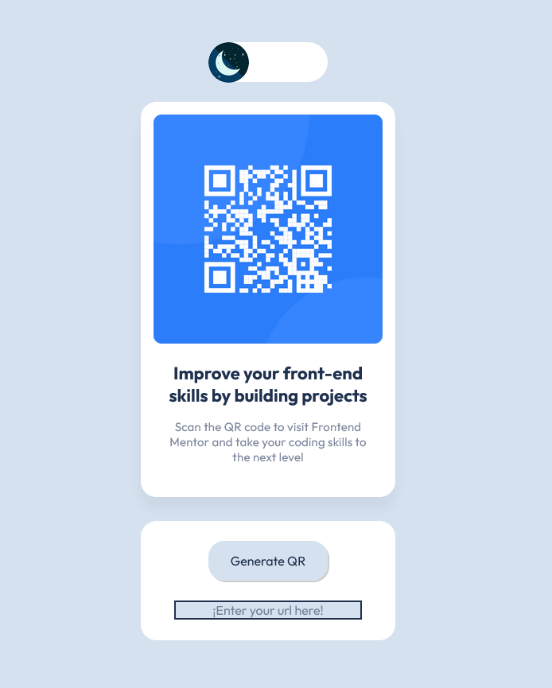
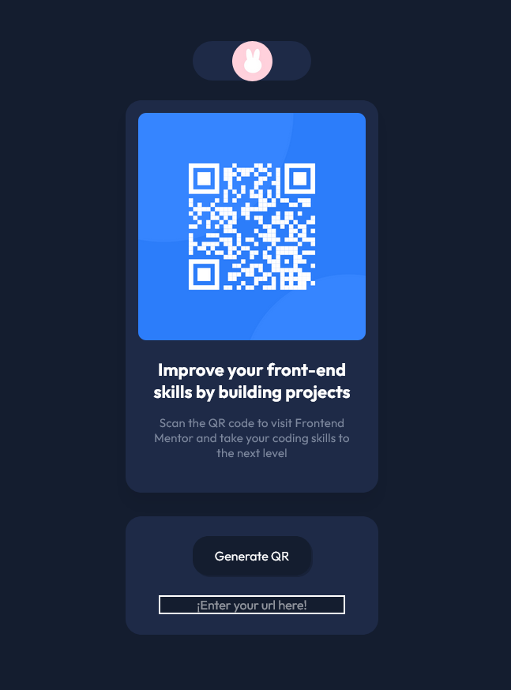
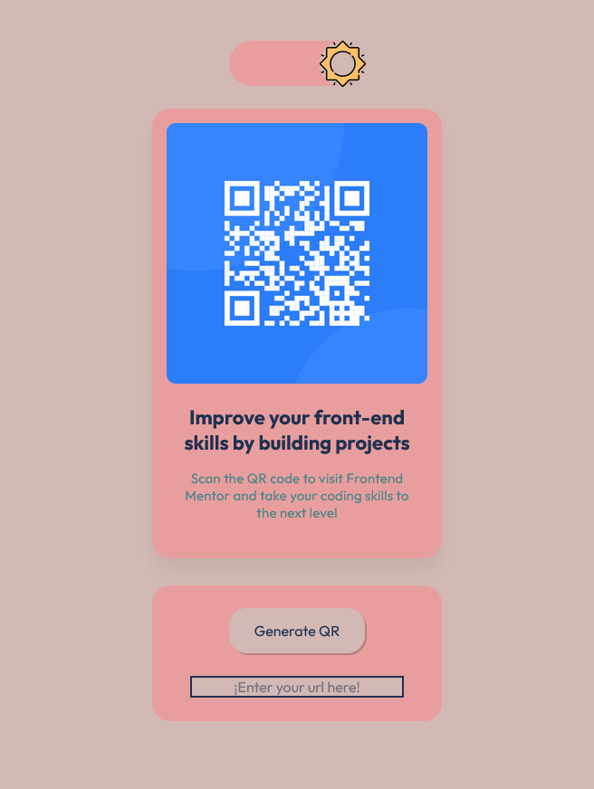
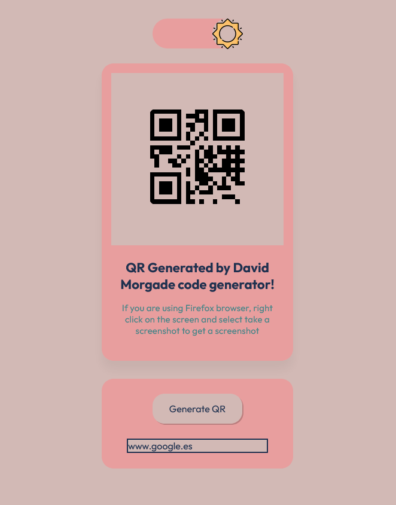

# Frontend Mentor - QR code component solution

Hello and welcome to my custom QR component generator, this is a solution for: [QR code component challenge on Frontend Mentor](https://www.frontendmentor.io/challenges/qr-code-component-iux_sIO_H), but this one has some extra features that I will explain on the next sections.

## Table of contents

- [Overview](#overview)
  - [Screenshots](#screenshots)
  - [Extra Features](#extra-features)
  - [Links](#links)
- [My process](#my-process)
  - [Built with](#built-with)
  - [What I learned](#what-i-learned)
  - [Continued development](#continued-development)
  - [Useful resources](#useful-resources)
- [Author](#author)
- [Acknowledgments](#acknowledgments)

## Overview

### Screenshots

Light Theme:



Dark Theme:



Pinky Theme:



Custom QR Code:



### Extra Features

- Custom Dark, Light and Pink themes made with styled component theming.
- Theming based on your OS theme setup on the first login.
- Theming save even after relog!
- Get your own QR code with the "Generate QR" button.

### Links

- Solution URL: [Solution URL](https://www.frontendmentor.io/solutions/qr-generator-light-dark-and-pink-themes-react-and-styled-components-kEp7gn0yUP)
- Live Site URL: [Live site URL](https://triple-themed-qr-component.vercel.app/)

## My process

### Built with

- Semantic HTML5 markup
- CSS custom properties
- Flexbox
- CSS Grid
- Mobile-first workflow
- [React](https://reactjs.org/) - JS library
- [Next.js](https://nextjs.org/) - React framework
- [Styled Components](https://styled-components.com/) - For styles

**Note: These are just examples. Delete this note and replace the list above with your own choices**

### What I learned

Styled components themes:

```js
export const lightTheme = {
  body: '#D5E1EF',
  main: '#FFFFFF',
  heading: '#1F314F',
  text: '#7D889E',
};
export const darkTheme = {
  body: '#141D2F',
  main: '#1E2A47',
  heading: '#FFFFFF',
  text: '#7D889E',
};
export const pinkTheme = {
  body: '#D2B9B5',
  main: '#E89E9E',
  heading: '#1F314F',
  text: '#458588',
};

```

The useDarkMode hook with pink theme, that gets the user default theme and save in localstorage the current theme, persists on reloads:

```jsx
import { useEffect, useState } from 'react';
export const useDarkMode = () => {
  const [theme, setTheme] = useState('light');

  const setMode = (mode) => {
    window.localStorage.setItem('theme', mode);
    setTheme(mode);
  };

  const themeToggler = () => {
    theme === 'light'
      ? setMode('dark')
      : theme === 'pink'
      ? setMode('light')
      : setMode('pink');
  };

  useEffect(() => {
    const localTheme = window.localStorage.getItem('theme');
    if (
      window.matchMedia &&
      window.matchMedia('(prefers-color-scheme: dark)').matches
    ) {
      setTheme('dark');
    } else {
      setTheme('light');
    }
    localTheme && setTheme(localTheme);
  }, []);
  return [theme, themeToggler];
};

```

### Continued development

- Practice more on theming and light and dark modes.
- Practice with APIs

### Useful resources

- [QR code API documentation](https://goqr.me/api/) - This helped me archive the QR generator!


## Author


- Website - [DavidMorgade](https://github.com/DavidMorgade/)
- Frontend Mentor - [@DavidMorgade](https://www.frontendmentor.io/profile/DavidMorgade)
- Twitter - [@MeSabeAgridulce](https://www.twitter.com/mesabeagridulce)


## Acknowledgments

Got inspired by @correlucas solution: [Solution](https://www.frontendmentor.io/solutions/qr-code-component-vanilla-cs-js-darklight-mode-nS2aOYYsJR)
Also got inspired by @denielden: [Solution](https://www.frontendmentor.io/solutions/react-qr-code-generator-3qWn2J0KS) 
