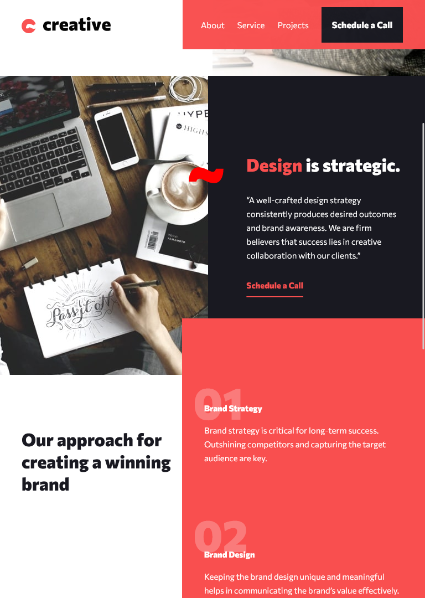
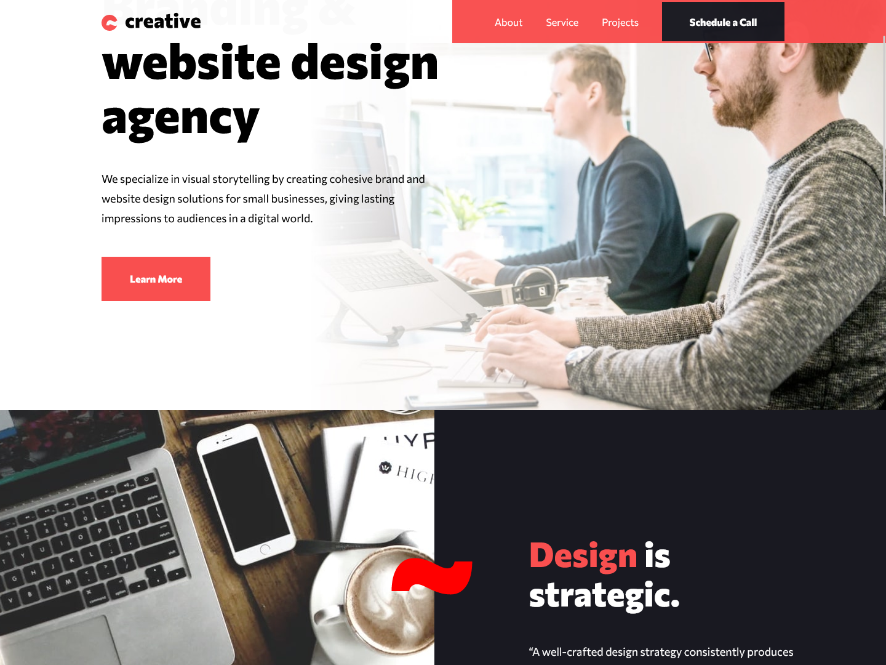

# Frontend Mentor - Creative agency single page site solution

This is a solution to the [Creative agency single page site challenge on Frontend Mentor](https://www.frontendmentor.io/challenges/creative-agency-singlepage-site-Pq6V3I2RM). Thanks for coming in and see how I built this Single page project!

## Table of contents

- [Overview](#overview)
  - [Screenshot](#screenshot)
  - [Links](#links)
- [My process](#my-process)
  - [Built with](#built-with)
  - [Continued development](#continued-development)
- [Author](#author)
- [Acknowledgments](#acknowledgments)

## Overview

### Screenshot

Tablet:

Desktop:

Mobile:

### Links

- Solution URL: [Solution URL](https://your-solution-url.com)
- Live Site URL: [Live site URL](https://creative-agency-single-page.vercel.app/)

## My process

### Built with

- Semantic HTML5 markup
- Flexbox
- CSS Grid
- Mobile-first workflow
- [React](https://reactjs.org/) - JS library
- [Styled Components](https://styled-components.com/) - For styles
- Swiper.js - For Slider

### Continued development

This project helped me understand better how to position elements and pseudoelements with position relative / absolute without breaking the layout, also learnt that styled components props always have to go camelCase

## Author

- Website - [In process](https://github.com/DavidMorgade)
- Frontend Mentor - [@DavidMorgade](https://www.frontendmentor.io/profile/DavidMorgade)
- Twitter - [@MeSabeAgridulce](https://www.twitter.com/mesabeagridulce)

## Acknowledgments

Thanks to all of the FEM community for being there helping and also to the people that took my feedback and work into consideration!, and as always, thanks you my wife and my little baby for being there suporting me all day.
