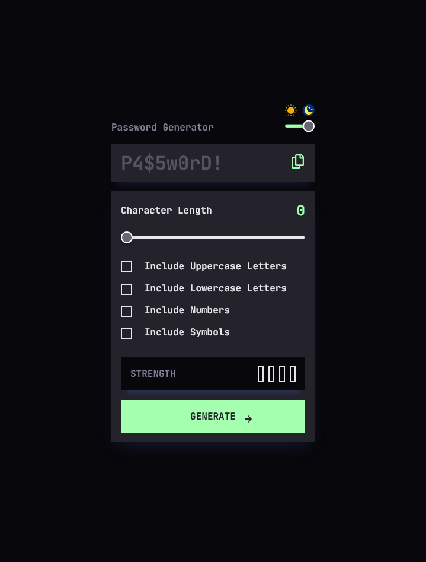
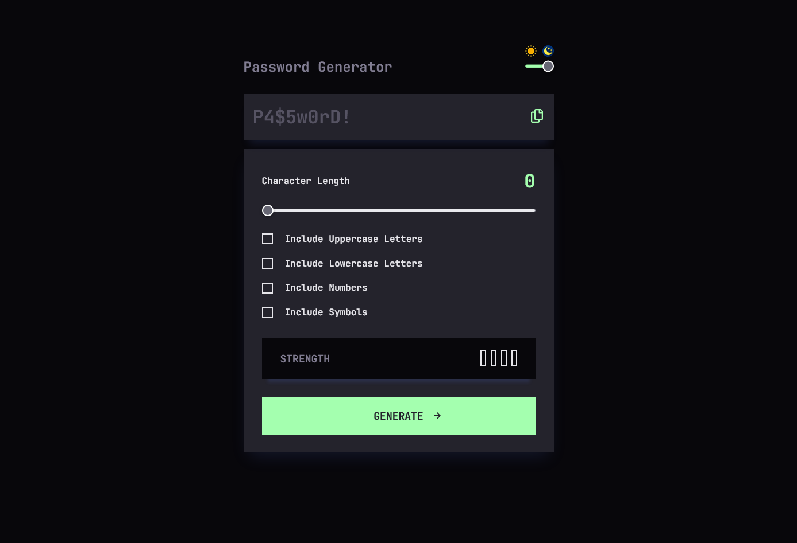
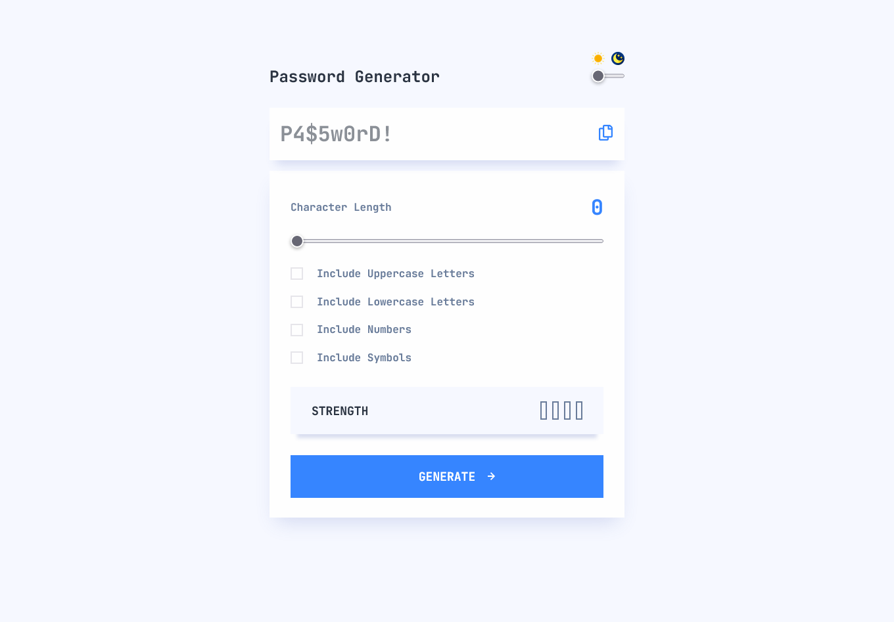

# Frontend Mentor - Password generator app solution

This is a solution to the [Password generator app challenge on Frontend Mentor](https://www.frontendmentor.io/challenges/password-generator-app-Mr8CLycqjh). Hope you like my solution to this challenge, if you have any suggestions / changes, I'm all ears!

## Table of contents

- [Overview](#overview)
  - [Screenshot](#screenshot)
  - [Links](#links)
- [My process](#my-process)
  - [Built with](#built-with)
  - [What I learned](#what-i-learned)
  - [Continued development](#continued-development)
  - [Useful resources](#useful-resources)
- [Author](#author)
- [Acknowledgments](#acknowledgments)


## Overview


### Screenshot

Mobile size:



Desktop size:



Light Theme:




### Links

- Solution URL: [Add solution URL here](https://your-solution-url.com)
- Live Site URL: [Vercel Live URL](https://password-generator-lovat-gamma.vercel.app/)

## My process

### Built with

- Semantic HTML5 markup
- Flexbox
- CSS Grid
- Mobile-first workflow
- [React](https://reactjs.org/) - JS library
- [Styled Components](https://styled-components.com/) - For styles


### What I learned

In this section I learnt how to use an input of type='range' and how to manipulate the state depending on the value of this input.

Also learnt how to use the filter method to color images depending on the theme, this are my theme properties:

```jsx
export const darkTheme = {
  body: '#08070B',
  main: '#24232C',
  box: '#18171F',
  heading: '#817D92',
  text: '#E6E5EA',
  strong: '#A4FFAF',
  medium: 'F8CD65',
  weak: '#FB7C58',
  tooWeak: '#F64A4A',
  button: '',
  copyclip: `brightness(0) invert(1)`,
};
export const lightTheme = {
  body: '#F6F8FF',
  main: '#FEFEFE',
  box: '#FFFFFF',
  heading: '#2B3442',
  text: '#697C9A',
  strong: '#3685FF',
  medium: 'F8CD65',
  weak: '#FB7C58',
  tooWeak: '#F64A4A',
  button: 'brightness(0) invert(1);',
  buttonHover: `invert(47%) sepia(71%) saturate(3277%) hue-rotate(201deg) brightness(100%) contrast(101%)`,
  copyclip: `brightness(100) invert(1)`,
  copyclipLight:
    'brightness(0) saturate(100%) invert(62%) sepia(72%) saturate(6526%) hue-rotate(206deg) brightness(107%) contrast(101%);',
};
```

Also learnt how to use local fonts on my project using font-face on my GlobalStyle.js:

```js
import { createGlobalStyle } from 'styled-components';
import JetBrains from '../../fonts/JetBrainsMono-VariableFont_wght.ttf';

export const GlobalStyles = createGlobalStyle`
    @font-face {
    font-family: 'JetBrains';
    src: url(${JetBrains}) format('truetype');
    }
    body {
        background: ${(props) => props.theme.body};
        transition: background 0.5s linear;
        font-family: 'JetBrains', sans-serif;
        display: flex;
        justify-content: center;
        align-items: center;
        min-height: 100vh;
    }
`;
```

### Continued development

Thanks to this project I realized that I have to focus more on forms, not only on validating them but also manipulating checkboxes, customizing with pseudoelements, adding accent color was a life safer!


### Useful resources

- [Hex to filter](https://codepen.io/sosuke/pen/Pjoqqp) - This codepen helped me getting the desired hex color for the images using filter.


## Author

- Website - [In process](https://github.com/DavidMorgade)
- Frontend Mentor - [@DavidMorgade](https://www.frontendmentor.io/profile/DavidMorgade)
- Twitter - [@mesabeagridulce](https://www.twitter.com/mesabeagridulce)


## Acknowledgments

Thanks to all of the FEM community, and as always, thanks to my wife and my little boy for helping me out proggresing and finishing all of my projects!
