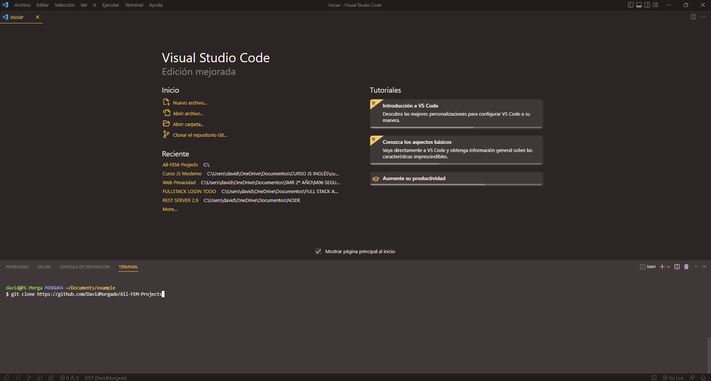
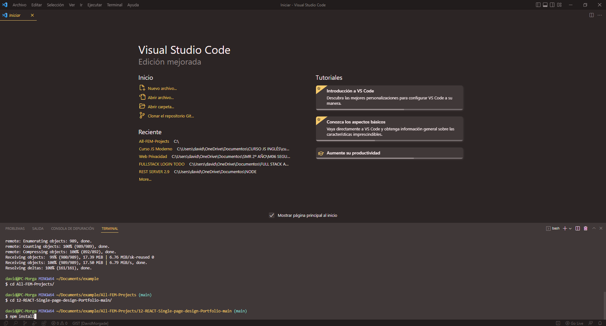
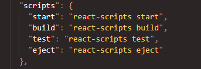

<a name="readme-top"></a>

[![Contributors][contributors-shield]][contributors-url]
[![Forks][forks-shield]][forks-url]
[![Stargazers][stars-shield]][stars-url]
[![Issues][issues-shield]][issues-url]
[![MIT License][license-shield]][license-url]
[![LinkedIn][linkedin-shield]][linkedin-url]

<br />

<br />

<div align="center">
  <a href="https://github.com/DavidMorgade/All-FEM-Projects">
    
  </a>
  
<br />

<h1 align="center">FontEndMentor Challenges - Solutions</h1>

<br />

  <h2 align="center">
    David Morgade
    <br />
    <a href="https://github.com/DavidMorgade/All-FEM-Projects/issues">Report Bug</a>
    ·
    <a href="https://github.com/DavidMorgade/All-FEM-Projects/pulls">Request Feature</a>
        ·
    <a href="https://www.frontendmentor.io/profile/DavidMorgade">FEM Profile</a>
  </h2>
  
</div>

<!-- TABLE OF CONTENTS -->
<details>
  <summary>Table of Contents</summary>
  <ol>
    <li>
      <a href="#about-the-repository">About The Repository</a>
      <ul>
        <li><a href="#resume">Resume</a></li>
      </ul>
      <ul>
        <li><a href="#technologies">Technologies</a></li>
      </ul>
      <ul>
        <li>
          <details>
            <summary>Projects</summary>
            <ol>
              <li><a href="https://github.com/DavidMorgade/All-FEM-Projects/tree/main/01-interactive-card-details-form-main">VANILLAJS - Interactive Card Details Form</a></li>
              <li><a href="https://github.com/DavidMorgade/All-FEM-Projects/tree/main/02-AdviceGeneratorApp-main">VANILLAJS - Advice Generator App</a></li>
              <li><a href="https://github.com/DavidMorgade/All-FEM-Projects/tree/main/03-E-commerce-product-page-main">VANILLAJS - E-Commerce Product Page</a></li>
              <li><a href="https://github.com/DavidMorgade/All-FEM-Projects/tree/main/04-Tip-Calculator-main">VANILLAJS - Tip Calculator</a></li>
              <li><a href="https://github.com/DavidMorgade/All-FEM-Projects/tree/main/05-Interactive-Rate-Component-main">VANILLAJS - Interactive Rate Component</a></li>
              <li><a href="https://github.com/DavidMorgade/All-FEM-Projects/tree/main/06-REACT-Time-Tracking-Dashboard-main">REACT - Time Tracking Dashboard</a></li>
              <li><a href="https://github.com/DavidMorgade/All-FEM-Projects/tree/main/07-NEXTJS-Space-tourism-page-Frontendmentor-main">NEXTJS - Space Tourism SPA</a></li>
              <li><a href="https://github.com/DavidMorgade/All-FEM-Projects/tree/main/08-REACT-Rock-paper-scissor-main">REACT - Rock, Paper, Scissors</a></li>
              <li><a href="https://github.com/DavidMorgade/All-FEM-Projects/tree/main/09-REACT-github-user-search-app-main">REACT - Github User Search App</a></li>
              <li><a href="https://github.com/DavidMorgade/All-FEM-Projects/tree/main/10-REACT-IP-Address-tracker-main">REACT - Ip Address Tracker</a></li>
              <li><a href="https://github.com/DavidMorgade/All-FEM-Projects/tree/main/11-REACT-Triple-themed-QR-component-main">REACT - QR Component</a></li>
              <li><a href="https://github.com/DavidMorgade/All-FEM-Projects/tree/main/12-REACT-Single-page-design-Portfolio-main">REACT - Single Page Design Portfolio</a></li>
              <li><a href="https://github.com/DavidMorgade/All-FEM-Projects/tree/main/13-REACT-Creative-Agency-single-page-main">REACT - Creative Agency Single Page</a></li>
              <li><a href="https://github.com/DavidMorgade/All-FEM-Projects/tree/main/14-VANILLAJS-IntroSection-Dropdown-main">VANILLAJS - IntroSection Dropdown Navigation</a></li>
              <li><a href="https://github.com/DavidMorgade/All-FEM-Projects/tree/main/15-REACT-Password-generator-main">REACT - Password Generator</a></li>
            </ol>
          </details>
        </li>
      </ul>
    </li>
    <li>
      <a href="#getting-started">Getting Started</a>
      <ul>
        <li><a href="#installation">Installation</a></li>
      </ul>
    </li>
    <li><a href="#usage">Usage</a></li>
    <li><a href="#roadmap">Roadmap</a></li>
    <li><a href="#contributing">Contributing</a></li>
    <li><a href="#license">License</a></li>
    <li><a href="#contact">Contact</a></li>

  </ol>
</details>

<!-- ABOUT THE REPOSITORY -->
<br/>
<br/>

# About The Repository

<br/>

[![FEM Profile Screenshot][product-screenshot]](https://example.com)

<p align="right">(<a href="#readme-top">back to top</a>)</p>

## Resume

Hello fellow visitor, my name is David Morgade and this is my All-in-one FEM solutions repository, here you can navigate to any solution that you need for your personal purpose, feel free to Download / Fork and use freely any of this solutions.

I Hope that any info on this repository can help you get through any kind of challenge!

<p align="right">(<a href="#readme-top">back to top</a>)</p>

## Technologies

<br/>

- [![Next][next.js]][next-url]

  <br/>

- [![React][react.js]][react-url]

  <br/>

- [![Javascript][javascript.com]][javascript-url]

<p align="right">(<a href="#readme-top">back to top</a>)</p>

<!-- GETTING STARTED -->

## Getting Started

<br/>
For Vanilla Javascript you can use Five Server VSCode extension to run the project locally, no need of external packages install unless they have a external library such as <a href="https://github.com/DavidMorgade/All-FEM-Projects/issues">SwiperJS</a>.

<br/>

For any project build with a external package / library follow the next instructions:

<br/>

### Installation

1. Download <a href="https://nodejs.org/">Node JS</a> latest stable version with NPM.
2. Clone the repo
   ```sh
   git clone https://github.com/DavidMorgade/All-FEM-Projects
   ```
3. Install NPM packages (On the desired project folder you want to use)
   ```sh
   npm install
   ```

<p align="right">(<a href="#readme-top">back to top</a>)</p>

<!-- USAGE EXAMPLES -->

## Usage

   <br/>
1. Cloning the repo locally:

   <br/>
   <br/>



   <br/>
2. Run npm install on the project folder:

   <br/>
   <br/>



   <br/>
3. Check package.json scripts to run the app on the browser:

   <br/>
   <br/>



<p align="right">(<a href="#readme-top">back to top</a>)</p>

<!-- ROADMAP -->

## Roadmap

See the [open issues](https://github.com/DavidMorgade/All-FEM-Projects/issues) for a full list of proposed features (and known issues).

<p align="right">(<a href="#readme-top">back to top</a>)</p>

<!-- CONTRIBUTING -->

## Contributing

Contributions are what make the open source community such an amazing place to learn, inspire, and create. Any contributions you make are **greatly appreciated**.

If you have a suggestion that would make this better, please fork the repo and create a pull request. You can also simply open an issue with the tag "enhancement".
Don't forget to give the project a star! Thanks again!

1. Fork the Project
2. Create your Feature Branch (`git checkout -b feature/AmazingFeature`)
3. Commit your Changes (`git commit -m 'Add some AmazingFeature'`)
4. Push to the Branch (`git push origin feature/AmazingFeature`)
5. Open a Pull Request

<p align="right">(<a href="#readme-top">back to top</a>)</p>

<!-- LICENSE -->

## License

Distributed under the MIT License. See `LICENSE` for more information.

<p align="right">(<a href="#readme-top">back to top</a>)</p>

<!-- CONTACT -->

## Contact

David Morgade - [@MeSabeAgridulce](https://twitter.com/MeSabeAgridulce) - davidmorgadegil@gmail.com

Project Link: [https://github.com/DavidMorgade/All-FEM-Projects](https://github.com/DavidMorgade/All-FEM-Projects)

<p align="right">(<a href="#readme-top">back to top</a>)</p>

## Acknowledgments

README created using a template from <a href="https://github.com/othneildrew">othneildrew</a> , github repository: <a href="https://github.com/othneildrew/Best-README-Template">Best-README-Template</a>

<!-- MARKDOWN LINKS & IMAGES -->
<!-- https://www.markdownguide.org/basic-syntax/#reference-style-links -->

[contributors-shield]: https://img.shields.io/github/contributors/DavidMorgade/All-FEM-Projects.svg?style=for-the-badge
[contributors-url]: https://github.com/DavidMorgade/All-FEM-Projects/graphs/contributors
[forks-shield]: https://img.shields.io/github/forks/DavidMorgade/All-FEM-Projects.svg?style=for-the-badge
[forks-url]: https://github.com/DavidMorgade/All-FEM-Projects/network/members
[stars-shield]: https://img.shields.io/github/stars/DavidMorgade/All-FEM-Projects.svg?style=for-the-badge&color=d6c157
[stars-url]: https://github.com/DavidMorgade/All-FEM-Projects/stargazers
[issues-shield]: https://img.shields.io/github/issues/DavidMorgade/All-FEM-Projects.svg?style=for-the-badge&color=8f0000
[issues-url]: https://github.com/DavidMorgade/All-FEM-Projects/LICENSE
[license-shield]: https://img.shields.io/github/license/DavidMorgade/All-FEM-Projects.svg?style=for-the-badge
[license-url]: https://github.com/DavidMorgade/All-FEM-Projects/blob/master/LICENSE
[linkedin-shield]: https://img.shields.io/badge/-LinkedIn-black.svg?style=for-the-badge&logo=linkedin&logoColor=black&color=1dddd7
[linkedin-url]: https://www.linkedin.com/in/davidmorgade/
[product-screenshot]: Screenshots/ProfileFEM.png
[next.js]: https://img.shields.io/badge/next.js-000000?style=for-the-badge&logo=nextdotjs&logoColor=white
[next-url]: https://nextjs.org/
[react.js]: https://img.shields.io/badge/React-20232A?style=for-the-badge&logo=react&logoColor=61DAFB
[react-url]: https://reactjs.org/
[vue.js]: https://img.shields.io/badge/Vue.js-35495E?style=for-the-badge&logo=vuedotjs&logoColor=4FC08D
[vue-url]: https://vuejs.org/
[angular.io]: https://img.shields.io/badge/Angular-DD0031?style=for-the-badge&logo=angular&logoColor=white
[angular-url]: https://angular.io/
[svelte.dev]: https://img.shields.io/badge/Svelte-4A4A55?style=for-the-badge&logo=svelte&logoColor=FF3E00
[svelte-url]: https://svelte.dev/
[laravel.com]: https://img.shields.io/badge/Laravel-FF2D20?style=for-the-badge&logo=laravel&logoColor=white
[laravel-url]: https://laravel.com
[bootstrap.com]: https://img.shields.io/badge/Bootstrap-563D7C?style=for-the-badge&logo=bootstrap&logoColor=white
[bootstrap-url]: https://getbootstrap.com
[jquery.com]: https://img.shields.io/badge/jQuery-0769AD?style=for-the-badge&logo=jquery&logoColor=white
[jquery-url]: https://jquery.com
[javascript.com]: https://img.shields.io/badge/javascript-000222?style=for-the-badge&logo=javascript&logoColor=yellow
[javascript-url]: https://developer.mozilla.org/en-US/docs/Web/JavaScript
